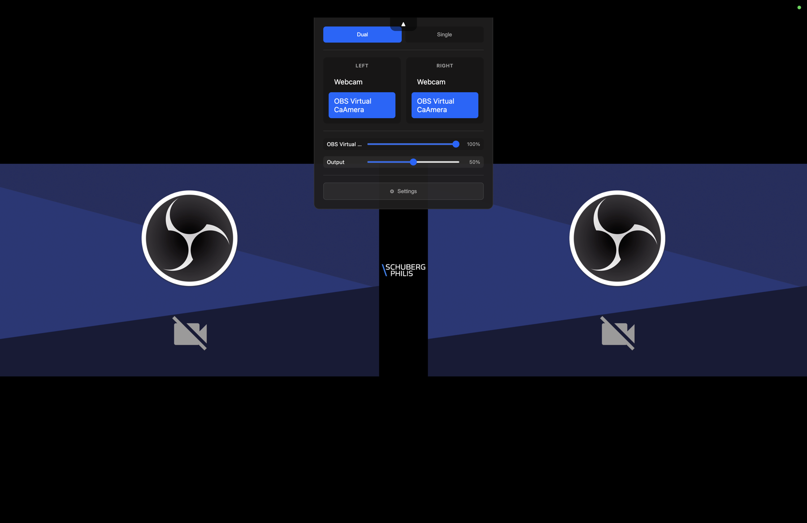

# Input Viewer

[](https://github.com/LAB271/labs-input-viewer/actions/workflows/ci.yml)
[](https://github.com/LAB271/labs-input-viewer/releases/latest)
[](LICENSE)

A lightweight video input viewer — **OBS without the complexity**. View and manage capture card feeds with a clean, simple interface designed for users who need to display video inputs without the overhead of full streaming software.



*Dual view with the dropdown open: per-side input selection, per-input and
system volume, and the centre divider between the two feeds.*

## Download

Download the latest release for your platform:

- **macOS**: [Input Viewer.dmg](https://github.com/LAB271/labs-input-viewer/releases/latest)
- **Windows**: [Input Viewer Setup.exe](https://github.com/LAB271/labs-input-viewer/releases/latest)

The app includes auto-updates and will notify you when new versions are available.

> **Note:** Releases live in **this** repository. The separate
> `LAB271/input-viewer-releases` repo is retired — it stopped receiving
> builds at v2.5.2 and is no longer authoritative. The in-app auto-updater
> also points here, so downloads and updates come from the same place.

## Features

- **Multi-input display** — View one or two video feeds side by side
- **Layout switching** — Dual view or single feed centered
- **Direct input selection** — Number keys 1-4 to switch inputs instantly
- **Freeze frame** — Pause any feed with Space key
- **Settings panel** — Configure inputs with toggle switches
- **No-signal detection** — Custom overlay when source disconnects
- **29 screensavers** — GPU-rendered WebGL2, one picked at random when every feed
  loses signal, rotating every 10 minutes. Includes a live weather display and
  optional Art-Net room lighting, both off by default
- **Fullscreen support** — Designed for dedicated display setups
- **Auto-updater** — Automatic updates from GitHub releases
- **Any capture card** — Works with any video capture device

## Keyboard Shortcuts

| Key         | Action                              |
| ----------- | ----------------------------------- |
| `D`         | Dual view (both feeds)              |
| `S`         | Single view (selected feed centered)|
| `1-4`       | Select input directly               |
| `Space`     | Freeze/unfreeze current feed        |
| `F11` / `F` | Toggle fullscreen                   |
| `Escape`    | Exit fullscreen                     |
| `Q`         | Quit                                |
| `V`         | Show/hide the screensaver           |
| `+` / `-`   | Step through the screensavers       |
| `←` `PgUp` / `→` `PgDn` | Presentation back / forward (if the remote keyboard is enabled) |

`V` starts the screensaver immediately rather than waiting out the five-minute
no-signal delay, and `+` / `-` step through the set (wrapping at both ends).
Stepping restarts the rotation countdown, so a manual pick is not replaced
moments later by the automatic rotation.

Hover over the top edge to reveal the settings dropdown panel.

## Configuration

### Settings Panel

Click the ⚙ gear icon to open the settings panel:

- **Toggle inputs** on/off
- **Set default input** (shown at startup)
- **Rename inputs** for easy identification
- **Adjust center gap** between feeds
- **Adjust border width** on sides
- Changes are saved automatically

### settings.json

Settings are stored in the app's user data directory — the Settings panel shows
the exact path. Inputs are keyed by capture device id, since index order is not
stable across reboots:

```json
{
  "leftDeviceId": null,
  "rightDeviceId": null,
  "layoutMode": null,
  "centerGap": 60,
  "borderWidth": 0,
  "inputs": {
    "<capture-device-id>": { "name": "Laptop", "enabled": true }
  }
}
```

[`settings.example.json`](settings.example.json) in the repo root lists every
key with its default. It is documentation only; the app does not read it.

### Weather screensaver and network access

Input Viewer makes **no outbound network requests** except two, both of which you
control:

| Feature | Destination | Default |
|---|---|---|
| Auto-update | GitHub Releases on `LAB271/labs-input-viewer` | on |
| Weather screensaver | `api.open-meteo.com` | **off** |
| Art-Net reactive mode | your `artnet-relay` host | **off** |

The weather screensaver (issue #101) renders the current conditions for a
configured location: precipitation falls at the observed rate, wind pushes it,
cloud cover sets the sky, and the palette follows local day and night.

It is **off by default** and stays entirely silent until you enable it — with
`weatherEnabled: false` no request is ever made and the screensaver never appears
in the rotation. To turn it on:

```json
{
  "weatherEnabled": true,
  "weatherLatitude": 52.37,
  "weatherLongitude": 4.89
}
```

What to know before enabling it:

- **Where the data goes.** The configured coordinates are sent to Open-Meteo on
  each poll. Open-Meteo needs no API key and no account, so there is no
  credential to store or leak. It is free for non-commercial use under CC-BY.
- **How coarse.** Coordinates are rounded to two decimals (~1 km) before the
  request leaves the app. Weather models are far coarser than that, so nothing is
  gained by configuring more precision.
- **How often.** At most once every 15 minutes, matching how often Open-Meteo
  updates, with exponential backoff up to an hour after repeated failures. An
  offline wall does not keep hammering the endpoint.
- **What happens when it fails.** Nothing visible. The last good reading keeps
  animating; once it is more than 12 hours old the screensaver removes itself
  from the rotation rather than showing stale weather. Activation never waits on
  the network.
- **Telling live from stale.** The readout shows the observation's age once it is
  over 30 minutes old, so a calm evening is distinguishable from frozen data.

### Art-Net reactive mode

While the no-signal screen is up, the dominant colour of whatever is on the wall
can be pushed to the room lighting through the
[`artnet-relay`](https://github.com/LAB271) service, so screen and room idle
together (issue #59).

**Off by default, and there is no default URL** — this posts to a host on your LAN
and physically changes the lighting. To enable it:

```json
{
  "artnetEnabled": true,
  "artnetUrl": "http://pi.labs:8000",
  "artnetTarget": "all",
  "artnetMaxBrightness": 0.8,
  "artnetReleaseScene": "",
  "artnetSpotDepth": 0.5
}
```

- **`artnetTarget`** — `all`, `group:<name>` or `strip:<name>`, mapping to the
  relay's `/all`, `/groups/{name}` and `/strips/{name}` endpoints. Or
  `effect:<name>` to run one of the relay's field effects instead of a flat
  colour — see **Spot mode** below.
- **`artnetSpotDepth`** — `0`–`1`, where in the room the spot sits, front to
  back. Only used by `effect:spot`.

These are all editable in **Settings → Art-Net Lighting**, which is the easier
route: the app rewrites `settings.json` whenever any setting changes, so a
hand-edit made while the app is running will be overwritten. `group:` and
`strip:` targets are site-specific and have no entry in the dropdown — set those
in the file, and the panel will preserve them rather than coercing the value.
- **`artnetMaxBrightness`** — ceiling on how bright the room can be driven, so a
  white screensaver cannot dazzle. `1` removes the limit.
- **`artnetReleaseScene`** — optional. When the screensaver stops, the relay stops
  being driven and the fixtures simply **keep their last colour**; nothing is sent
  unless you name a scene here. That default is deliberate: a blackout would
  plunge a room that may have people in it into darkness, and posting a scene
  every time would fight whatever normally owns the lights.

Operational notes:

- **One colour per second, at most**, with a fade slightly longer than that
  interval so consecutive sends glide rather than step.
- **The relay has no authentication**, so the URL is the entire capability. Treat
  it accordingly. The app writes a colour, or an effect and its parameters, plus
  a scene name or `/stop` when the screensaver ends. It performs exactly one kind
  of read — `GET /status`, to learn the room's state before taking it over so it
  can be put back afterwards, and to list the scene names for the settings
  dropdowns.

#### Per-screensaver lighting, and getting the room back

Each screensaver can drive the room differently. In **Settings → Art-Net
Lighting → Per Screensaver**, or as `artnetSceneBySaver` keyed by a screensaver's
display name:

```json
{
  "artnetSceneBySaver": {
    "Matrix Rain": "scene:lab_modus",
    "Julia Family": "effect:spot",
    "DVD Logo": "off"
  }
}
```

- **`reactive`** (the default, and what an absent entry means) — drive the lights
  from the picture, using `artnetTarget`
- **`scene:<name>`** — hold that scene for as long as this screensaver is up
- **`effect:<name>`** — run that effect, overriding `artnetTarget`
- **`off`** — leave the room alone for this screensaver

Three screensavers pair with a matching effect out of the box — **Plasma** drives
the relay's `plasma` field, **Metaballs** drives `blobs`, **Wave Tank** drives
`ripple`. Choose *Reactive* for any of them to opt out. Only pairings where the
effect genuinely mirrors the screen are built in; a mismatched effect puts the
room out of step with the wall, which is worse than the dominant colour.

Each effect is driven with **its own parameters**, not one shared shape. `plasma`
and `aurora` generate their own colour and take `scale`/`speed`/`brightness`;
`spot` and `ripple` take a position; `blobs` takes a count and size. Effects the
relay cannot nudge (`fire`, `police`, `sparkle`, `chase`, …) are started once and
left alone, since changing their parameters means restarting them and resetting
their animation.

**The room is put back when the screensaver ends.** On activation the app reads
`GET /status` and remembers the per-strip colours, plus any effect that was
already running; when the signal returns it writes that back. So plugging a
laptop in restores the lighting to however it actually was — including *off* —
rather than to a configured guess.

Rotation between screensavers deliberately does **not** re-read that state. By
then the room is showing the app's own lighting, and re-reading would destroy the
only record of what was there before.

If the read fails, there is nothing to restore to, and the app falls back to
`artnetReleaseScene` if one is set and otherwise sends nothing at all — the
fixtures keep their last colour. Never a blackout: a room that may have people in
it does not go dark because a video signal came back.

#### Spot mode

Setting `artnetTarget` to `effect:spot` swaps the flat colour for a movable
circle of light that follows the bright part of the wall:

```json
{ "artnetTarget": "effect:spot", "artnetSpotDepth": 0.35 }
```

The effect is started once and then steered with small `/field/params` updates,
because re-starting it each second would reset its own animation phase and read
as a stutter. Size follows how concentrated the light is — a single bright
filament gives a tight spot, a full-frame wash a broad one.

**Only the horizontal axis comes from the picture.** The videowall is one edge
of the room, so screen-x has a real spatial counterpart and screen-y does not;
mapping the frame's vertical axis onto room depth would be an invention, and one
that looks like a wiring fault rather than a design choice. Depth is
`artnetSpotDepth` instead.

Unlike a colour, an effect does not stop on its own — it would keep running
after the wall woke up with nothing driving it. So an effect the app started is
one it stops, via `/stop`, unless `artnetReleaseScene` is set (that scene both
ends the effect and leaves the room somewhere deliberate).

Any other field effect works as a target too — `effect:ripple`,
`effect:plasma`, `effect:blobs`, `effect:aurora` — but only `spot` takes a
position, so the others just get the colour.
- **A dead relay is invisible.** Failures back off from 5 seconds to 5 minutes and
  never surface on the wall; the screensaver is unaffected.
- The POST is made from the **main process**, not the renderer. The renderer's
  origin is `file://` in production and the relay sends no CORS headers, so a
  renderer-side request never gets past the preflight.

## Development

### Prerequisites

- Node.js 24+ (the active LTS, and what CI builds on; Electron and the test
  tooling both require newer than 20)
- npm

### Setup

```bash
cd input_viewer_electron
npm install
npm run dev     # Development mode with hot reload
npm run build   # Build for production
```

### Building Installers

```bash
npm run build:mac   # Build macOS DMG
npm run build:win   # Build Windows installer
```

## Hardware

Works with:

- **Any capture card** — USB or PCIe capture devices
- **Any display** — adapts to your screen resolution
- **Platforms**: macOS, Windows

**Optimised for ultrawide.** It runs on any resolution, but the defaults are
tuned for very wide displays: on a screen with an aspect ratio of 3:1 or wider
it starts in dual view (two feeds side by side), and on anything narrower it
starts in single view. The reference deployment is a 6000×1200 projector
videowall, which is also what the screensaver scaling in
`src/renderer/screensavers/gl-base.js` is calibrated against.

## Repository Layout

| Path | What it is |
|------|------------|
| [`input_viewer_electron/`](input_viewer_electron/) | The application. Everything that ships is here. |
| [`docs/USER_GUIDE.md`](docs/USER_GUIDE.md) | End-user guide: booth setup, shortcuts, troubleshooting. |
| [`remote_keyboard/`](remote_keyboard/) | Arduino sketch (ESP32-S3) for the optional Remote Keyboard feature. Receives HTTP requests from the app over WiFi and emits USB HID keypresses to a presenter PC. Flash it separately; the app works without it. The WiFi credentials and API key in the sketch are placeholders to fill in before flashing. |
| [`spikes/`](spikes/) | Standalone HTML design prototypes (no-signal screen, dropdown/settings, an OpenCV detection experiment). Not built, shipped, or maintained — kept as a visual reference for how those screens were designed. |
| [`settings.example.json`](settings.example.json) | Documented example of the settings file. Reference only; the app reads its own copy from the user data directory. |

## Legacy Python Version

The original Python implementation was removed in v2.6.0 (it carried a GPL dependency). It remains available in the [`v2.5.3` source tree](https://github.com/Lab271/labs-input-viewer/tree/v2.5.3/input_viewer_python) but is no longer maintained. Use the Electron version for the best experience.

## Contributing

See [CONTRIBUTING.md](CONTRIBUTING.md).

## Security

Please report vulnerabilities privately, not as a GitHub issue. See
[SECURITY.md](SECURITY.md).

## License

Copyright 2025-2026 Schuberg Philis B.V.

Licensed under the Apache License, Version 2.0 (the "License"); you may not use
these files except in compliance with the License. You may obtain a copy of the
License in [LICENSE](LICENSE) or at <https://www.apache.org/licenses/LICENSE-2.0>.

Unless required by applicable law or agreed to in writing, software distributed
under the License is distributed on an "AS IS" BASIS, WITHOUT WARRANTIES OR
CONDITIONS OF ANY KIND, either express or implied. See the License for the specific
language governing permissions and limitations under the License.
